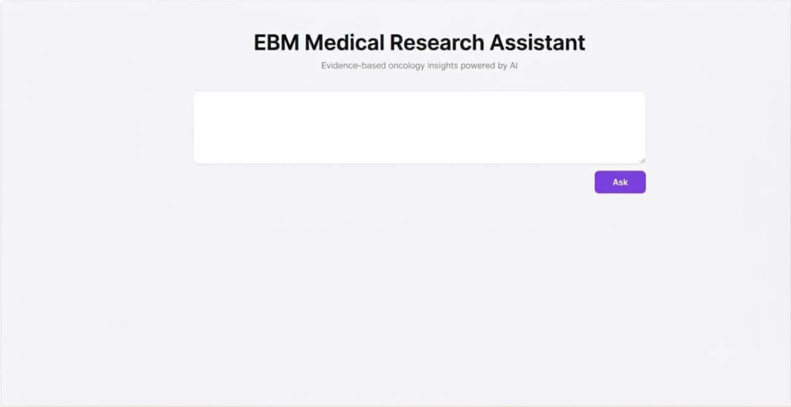
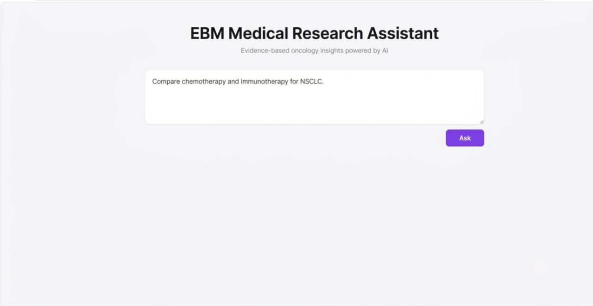
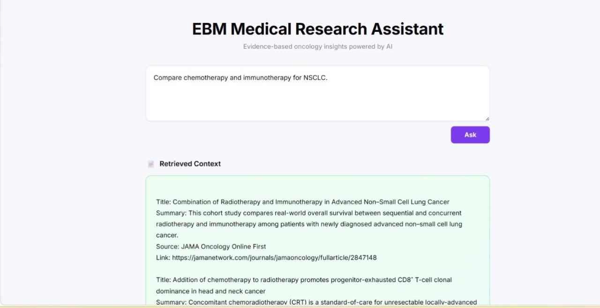

# 🩺 EBM Research Assistant

An **oncology-focused Evidence-Based Medicine (EBM) Research Assistant** that uses semantic search and medical language models to retrieve relevant research papers and generate evidence-grounded responses.

## 📌 Overview

The EBM Research Assistant helps doctors and researchers find relevant information from oncology research papers using a **Retrieval-Augmented Generation (RAG)** approach.

The system retrieves the most relevant research papers using **BioBERT embeddings and FAISS**, then provides the retrieved evidence to **BioMistral** to generate a context-grounded response.

> **Note:** This project is a research/educational prototype and is not intended to replace professional medical judgment.

---

## ✨ Key Features

* 🔬 Oncology-focused question answering
* 🧠 BioBERT-based semantic embeddings
* 🔎 FAISS similarity search
* 📚 Top-3 relevant research-paper retrieval
* 🤖 BioMistral for response generation
* 🗄️ PostgreSQL for research-paper data
* 🚫 Rejects non-oncology queries
* 📖 Evidence-based responses with research references

---

## 🔄 System Workflow

```text
User Query
    ↓
Oncology Query Validation
    ↓
BioBERT Embedding
    ↓
FAISS Semantic Search
    ↓
Top-3 Relevant Papers
    ↓
Retrieved Research Context
    ↓
BioMistral
    ↓
Evidence-Grounded Response
```

---

## 🛠️ Tech Stack

| Technology | Purpose                     |
| ---------- | --------------------------- |
| Python     | AI/ML & backend             |
| BioBERT    | Medical text embeddings     |
| FAISS      | Semantic vector search      |
| BioMistral | Medical response generation |
| PostgreSQL | Research-paper storage      |
| React      | Frontend                    |
| FastAPI    | Backend API                 |

---

## 📂 Project Structure

```text
EBM-Research-Assistant/
│
├── backend/
│   ├── app.py
│   ├── retrieval.py
│   ├── database.py
│   └── test_search.py
│   └── ...
│
├── frontend/
│   └── ...
│
├── requirements.txt
├── .env.example
├── .gitignore
└── README.md
```

---

## ⚙️ Setup

### 1. Clone the repository

```bash
git clone https://github.com/YOUR_USERNAME/EBM-Research-Assistant.git
cd EBM-Research-Assistant
```

### 2. Create a virtual environment

```bash
python -m venv venv
```

Windows:

```bash
venv\Scripts\activate
```

###  3. Installation

**Backend**

pip install -r requirements.txt

** Frontend**

npm install

### 4. Run the Project

** Backend**

cd backend

uvicorn app:app --reload

**Frontend**

npm run dev

### 5. Configure environment variables

Create a `.env` file using `.env.example` and add the required PostgreSQL and Hugging Face credentials.

**Do not commit API keys, passwords, or `.env` files to GitHub.**

---

## 🔍 Example Queries

### Oncology Query

```text
What are the current treatment approaches for breast cancer?
```

The system retrieves relevant oncology papers and generates a response based on the retrieved evidence.

### Non-Oncology Query

```text
What are the symptoms of diabetes?
```

The system rejects the query because it is outside the supported oncology domain.

---


## 📸 Screenshots

### 🏠 Home Page



### 🔍 Research Query



### 📄 Generated Response



---

## 🚀 Future Improvements

* Hybrid keyword + semantic search
* Improved citation verification
* Research-paper date filtering
* Advanced document reranking
* Expanded medical domains
* Conversational memory
* Improved retrieval and response evaluation

---

## 👨‍💻 Author

**Jay Desai**
Computer Engineering Student | AI/ML Enthusiast
